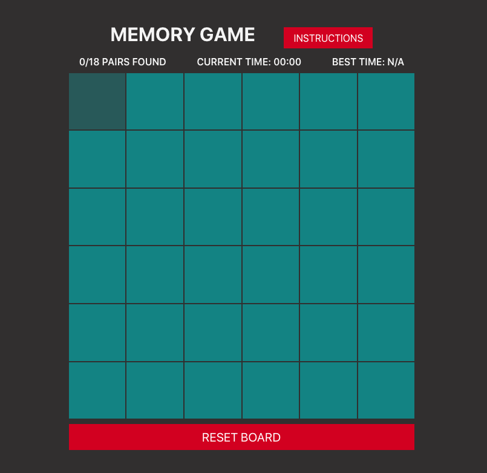

# Memory Game

This is a memory game built with React. It is a one player game where the user can try and match up card numbers. The game is able to track the game time as well as reset the game.

## Rules of the Game

* Click on any card to strat the game, the timer will start as well.
* Uncover two matching numbere at once to eliminate them from the game.
*  The game ends when all of the pairs of matching cards are found.
* Eliminate all cards as fast as you can in order to win best time stamp!
* Reset the game by clicking the Reset button and the cards will be reshuffled and the timer will be stopped until the game is started again.

## Built With

* React.js
* create-react-app

## Demo

Check out the [live demo]

## Getting Started

In a terminal window, navigate into the folder where you downloaded this app and type `npm install`. To start the app, type `npm start` and open your browser to `localhost:3000`.

